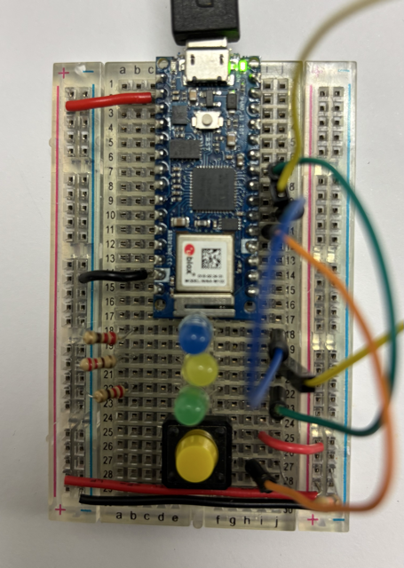
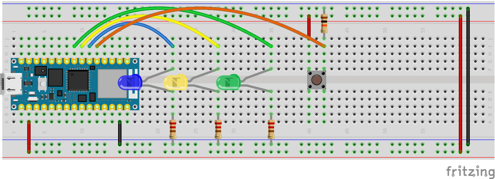

# Sockets Circuit Tester

## Build the Circuit

- Connect the top button let to 3.3V rail.
- Connect the bottom button leg to pin D2 with a 10k ohm pull down resistor to ground rail.
- Connect Blue LED long leg to pin D3, short leg to a  220 ohm resistor going to ground rail.
- Connect Yellow LED long leg to pin D4, short leg to a  220 ohm resistor going to ground rail.
- Connect Green LED long leg to pin D5, short leg to a  220 ohm resistor going to ground rail.

Note: the colors don't really matter, use whatever you want.

## Test it!
- Press the button, lights should turn on while the button is pressed

